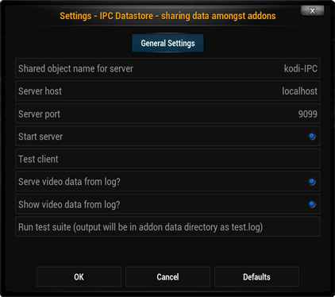

********************
service.ipcdatastore
********************

====================
Add On Settings Page
====================

.. highlight:: python
   :linenothreshold: 5

There are several configurable settings for the addon:

   1) The name to be used to address the object being shared. This is an arbitrary string.
   #) The socket host name.
   #) The socket port.
   #) Whether to start the server at startup.
   #) A simple test to assess if the server is working correctly which runs on clicking.
   #) Whether or not to place data regarding the currently playing video in the datastore automatically.
   #) Whether or not to show the above data as a notification when a video begins playing.
   #) A more detailed testing suite for the datastore object's methods which runs when clicked.

**Note:** When using the class IPCClientX (described below) if the addon id is specified, an attempt will be made to
retrieve the object name, host name and port from that addon's settings.xml. Thus, if ``addon_id='service.ipcdatastore'``
is provided, then these settings will be read in, even if the code is running in another addon.

????

=============================
Simple use case of IPCClientX
=============================

IPCClientX is really a class that wraps some core functionality of a shared dictionary object. Objects are stored in
the dictionary under a key consisting of the object's "name" and "author". This was implemented in this manner to
prevent naming conflicts if serveral different addons are placing objects in the datastore.

The name is required at the time that the data is stored using :func: `IPCClientX.set`. If the author is not provided
and the code is running under an addon whose id is available, that will be used. No addon id will be available when
the code is running from a 'RunScript' statement and an exception will be raised. Each object is time-stamped as it
is stored.

.. code-block:: python
   :linenos:
   :emphasize-lines: 5,7

    # Depending where this code is run from the location of the import may differ

    from resources.lib.ipcclientx import IPCClientX

    client = IPCClientX(addon_id='service.ipcdatastore')
    if client.server_available():
        x = client.set('x', 20, author='service.ipcdatastore')

On line 5, the client is instantiated using the ``addon_id`` syntax option. This cause the client to read the name,
host and port settings from the addon whose id is provided. This allows any other addon to discover the server's
settings at the time of instantiation instead of having to hard code it.

Line 6 first checks to see if the server is available using the inherited method from IPCClient from script.module.ipc.
This isn't truly necessary, but provides a graceful means of failure if the server is not up.

Line 7 then stores the object, in this case, an integer using the name 'x'. The author is explicitly given using a
keyword.

????

Retrieving the data is much as expected except that there are two additional optional keyword parameters:
   1) ``requestor``
   2) ``return_tuple``

The name of the data requestor may be provided, which also defaults to the addon name if not provided. This is used in the caching
mechanism (see below).

If ``return_tuple`` is False (default) the returned object is of the same 'type' as when it was stored. If
``return_tuple`` if True, the return is a namedtuple with three attributes: *value*, *ts* and *cached*. The *value* is
the actual object, *ts* is the timestamp (float) and *cached* is a boolean indicating if a cached value was used.

.. code-block:: python
   :linenos:
   :emphasize-lines: 7,13-16

    # Again, depending where this code is run from the location of the import may differ

    from resources.lib.ipcclientx import IPCClientX

    client = IPCClientX(addon_id='service.ipcdatastore')
    if client.server_available():
        x = client.get('x', author='service.ipcdatastore', requestor='testclient')
        xbmc.log("service.ipcdatastore variable 'x' = {0}".format(x))
    else:
        xbmc.log("service.ipcdatastore server unavailable")

    if client.server_available():
        nt = client.get('x', author='service.ipcdatastore', requestor='testclient', return_tuple=True)
        x = nt.value
        ts = nt.ts
        cached = nt.cached

Line 7 retrieves the data as described above, while lines 13-16 illustrate the use of the namedtuple. The value of
cached is provided mostly for testing purposes. The way the cache is implemented, there should be no circumstances
where a cached object has become 'stale'. See below.

-----------------
Caching mechanism
-----------------

Each time data is retrieved, the requestor and the ts of the data requested are stored on the server side. The data is
also stored on the client side. Also, at the time of each request, the server looks to see if the data has already been
provided to the current requestor and if so, if the current data timestamp is the same as what was provided to the
requestor during the last request. If it is, a one-byte message is returned instead of the object instructing the client
to look for the data in it's own local cache. If for some reason, the data is NOT in the local cache, another request
is sent with a tag instructing the server to provide the data regardless.

This was implemented for performance purposes to minimize the amount of the data sent 'over-the-wire'. In addition when
there is asynchronous data being provided and consumed, it will allow a consuming client to wait in a request loop
without transferring data with each request. This is illustrated in the following example.

============================
Advanved usage of IPCClientX
============================

::

    import xbmc
    from getlog...

    class PlayerServer(xbmc.Player):

        def __init__(self):
            super(PlayerServer, self).__init__()
            self.playingfile = None
            self.server_flag = False

        def onPlayBackStarted(self):
            self.playingfile = self.getPlayingFile()
            mydict = get_log_mediainfo()
            client = IPCClientX(addon_id='service.ipcdatastore')
            client.raise_exception = True
            client.set('videodata', mydict, author='service.ipcdatastore')
            self.server_flag = True
            del client

xxx

::

    import xbmc
    class PlayerClient(xbmc.Player):

        def __init__(self):
            super(PlayerClient, self).__init__()
            self.playingfile = None

        def onPlayBackStarted(self):
            self.playingfile = self.getPlayingFile()
            client = IPCClientX(addon_id='service.ipcdatastore')
            data = None
            numchecks = 8
            while numchecks > 0:
                data = client.get('videodata', author='service.ipcdatastore')
                if data is None:
                    xbmc.sleep(500)
                    numchecks -= 1
                else:
                    break
            dialog = xbmcgui.Dialog()
            if isinstance(data, dict):
                msg = '{0}x{1} @ {2}'.format(data['dwidth'], data['dheight'], data['fps'])
                dialog.notification('ipcdatastore', msg, None, 2000, True)
            else:
                dialog.notification('ipcdatastore', 'Time out error receiving data x {0}'.format(9 - numchecks),
                                    None, 2000, True)

=======================================
Class methods from service.ipcdatastore
=======================================

.. autoclass:: ipcclientx.IPCClientX
    :members:
    :show-inheritance:

.. index:: example usage

